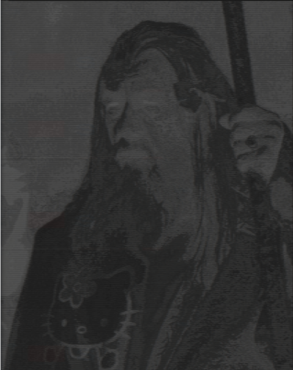

# i2a

Image to Ascii convertor made in C. The project is made with the help of [stb library](https://github.com/nothings/stb). 


## Usage

```
usage: i2a [file] [-h] [-v] [-a] [-f] [-l] [-m]

required arguments:
 [file]  file path of your image

optional arguments:
  -h, --help     show this help message and exit
  -v, --version  show current version
  -a, --about    show about page
  -f, --file     Save result into the file.
  -l, --less     Use ASCII list with less characters -> higher contrast.
  -m , --more    Use ASCII list with more characters -> better quality, worse contrast.
```


## Screenshots


| Original                                      | Ascii                                             |
| --------------------------------------------- | ------------------------------------------------- |
|  |          |
|         |  |


## TODO

- [x] show image in terminal

- [x] resize by terminal window

- [x] jpg support

- [ ] png support

- [ ] bmp support

- [ ] gif support

- [ ] video support

- [x] save to file

- [x] add argparse

- [x] ASCII list selection

- [ ] make code readable :(

  
