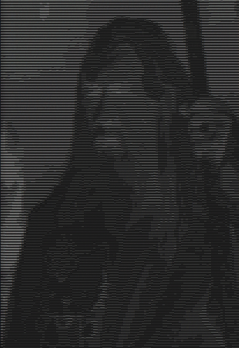
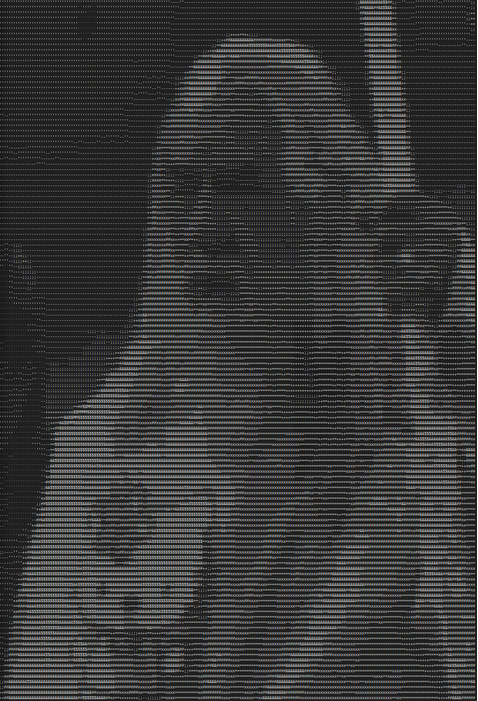
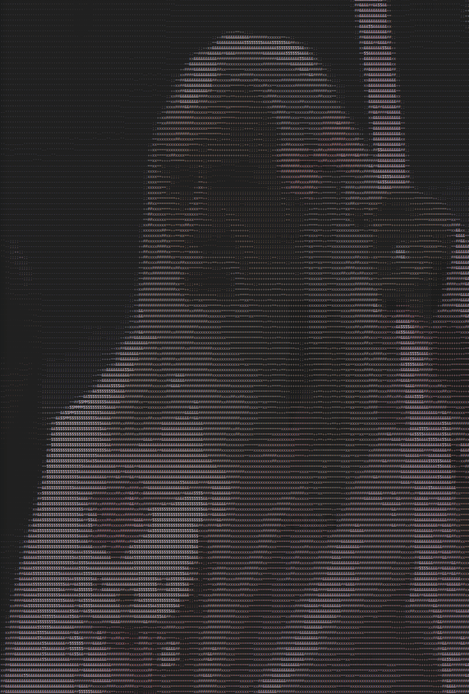

# i2a

<a href="images/icon.png"></a>***Image to Ascii*** converter created in C. Allows you to generate an ascii from any image and print it to a terminal or text file.  Supported formats are `png`, `jpg` and `bmp`. The project is created using the [stb library](https://github.com/nothings/stb). 

<br><br>


## Installation
```bash
# download package from github
wget -c https://github.com/tucnakomet1/i2a/archive/refs/tags/0.0.4.tar.gz -O i2a-v0.0.4.tar.gz

# extract tarball & go to the directory
tar -xvzf i2a-v0.0.4.tar.gz && cd i2a-0.0.4

# install package
make && sudo cp i2a /usr/local/bin/
```

<br><br>

## Usage

```
usage: i2a [file] [-h] [-v] [-a] [-f] [-l] [-m] [-c] [-C] [-Cc] [-i]

required arguments:
 [file]  file path of your image

optional arguments:
  -h,  --help		show this help message and exit
  -v,  --version		show current version
  -a,  --about		show about page
  -f,  --file		Save result into the file.
  -l,  --less		Use ASCII list with less characters -> higher contrast.
  -m,  --more		Use ASCII list with more characters -> better quality, worse contrast.
  -c,  --foreground	add foreground ANSI color to image
  -C,  --background	add background ANSi color to image
  -Cc, --color		Add foreground and background ANSI color to image
  -i,  --invert		invert colors

```


<br><br>

## Screenshots


| Original | Ascii | Inverted | Color fg | Color bg | Color fg + bg |
| -------- | ----- | -------- | -------- | -------- | ------------- |
|  |  |  | |  |  |


## TODO

- [x] show image in terminal
- [x] resize by terminal window
- [x] jpg support
- [x] png support
- [x] bmp support
- [ ] gif support
- [ ] video support
- [x] save to file
- [x] add argparse
- [x] ASCII list selection
- [x] add colors support
- [ ] make code readable :(

  
